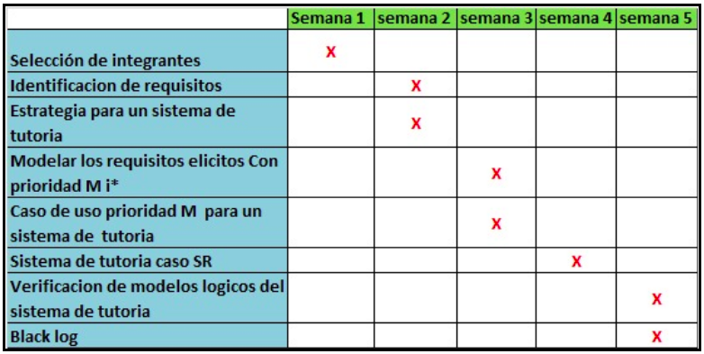

# **
Ing. De Software 
**
### Team Rocket

### Datos Academicos
  - **Institucion:** Universidad Nacional De San Antonio Abad Del Cusco
  - **Facultad:** Facultad De Ingenieria Eléctrica, Electrónica, Informática y Mecánica
  - **Escuela Profecional:** Ingenieria Informatica Y De Sistemas
#### Docente Encargada: **_QUINTANILLA PORTUGAL ROXANA LISETTE_** - _Docente_ - [Concytec](http://directorio.concytec.gob.pe/appDirectorioCTI/VerDatosInvestigador.do?id_investigador=40930).

#### Proyecto: SISTEMA DE TUTORIA
#### Autores:
- **_QUISPE CHAMBILLA CARLOS ENRIQUE_** - _GitHub Account_ - [VkCarlin](https://github.com/VkCarlin)
- **_BUSTAMANTE FLORES ERICK ANDREW_** - _GitHub Account_ - [VkCarlin](https://github.com/VkCarlin)
- **_CASILLA PERCCA VLADIMIR DANTE_** - _GitHub Account_ - [VkCarlin](https://github.com/VkCarlin)
- **_SARCO JACINTO DANIEL EDUARDO_** - _GitHub Account_ - [Mjinboodssj999](https://github.com/Mjinboodssj999)
- **_DORADO TORRES DIEGO ALONSO_** - _GitHub Account_ - [VkCarlin](https://github.com/VkCarlin)
- **_TTITO QUILCA CESAR RODRIGO_** - _GitHub Account_ - [VkCarlin](https://github.com/VkCarlin)
- **_RODRIGUEZ HANCCO RUDY RODRIGO_** - _GitHub Account_ - [VkCarlin](https://github.com/VkCarlin)
- **_UGARTE CASTILLO BRIGGITTE LEONOR_** - _GitHub Account_ - [VkCarlin](https://github.com/VkCarlin)

## Tabla de Contenido
- [Capítulo I: Aspectos Generales](https://github.com/VkCarlin/TeamRocket)
  - [1.1 Planteamiento del problema](https://github.com/VkCarlin/TeamRocket)
    - [1.1.1 Descripción del problema](https://github.com/VkCarlin/TeamRocket)
    - [1.1.2 Identificación del problema](https://github.com/VkCarlin/TeamRocket)
  - [1.2 Objetivos](https://github.com/VkCarlin/TeamRocket)
    - [1.2.1 Objetivo general](https://github.com/VkCarlin/TeamRocket)
    - [1.2.2 Objetivos específicos](https://github.com/VkCarlin/TeamRocket)
  - [1.3 Limitaciones y Delimitaciones](https://github.com/VkCarlin/TeamRocket)
  - [1.4 Justificación](https://github.com/VkCarlin/TeamRocket)
  - [1.5 Cronograma](https://github.com/VkCarlin/TeamRocket)

## Capítulo I: Aspectos Generales	

### 1.1 Planteamiento del problema	

#### 1.1.1 Descripción del problema	
  Observamos que la designación de docentes para realizar tutorías aún no se encuentra automatizada y debido a esto los alumnos no son identificados de manera rápida para poder recibir dichas tutorías.
#### 1.1.2 Identificación del problema	
  Identificar la asignación de los estudiantes para recibir las tutorías.
### 1.2 Objetivos

